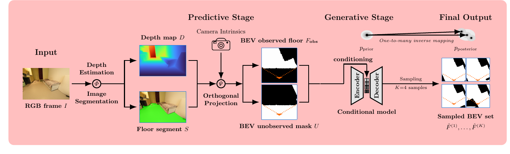

# FlatLands

**Generative Floormap Completion From a Single Egocentric View**

[Subhransu S. Bhattacharjee](https://1ssb.github.io/) &middot;
[Dylan Campbell](https://sites.google.com/view/djcampbell) &middot;
[Rahul Shome](https://rahulsho.me/)

**TL;DR:** FlatLands asks a model to complete a metric indoor floormap from one
partial egocentric observation and represent multiple plausible hidden layouts
instead of forcing a single guess.

<p>
  <a href="https://huggingface.co/datasets/Rudra1ssb/FlatLands">
    
  </a>
  <a href="https://arxiv.org/abs/2603.16016">
    
  </a>
</p>

### Data Acquisition

<p align="center">
  
  <br><sub>A physically valid virtual camera observation is back-projected, rasterized, and aligned into egocentric BEV maps.</sub>
</p>

### RGB-To-Floormap Process

<p align="center">
  
  <br><sub>One RGB frame becomes observed BEV evidence, then a conditional generator samples plausible hidden layouts.</sub>
</p>

## Release Status

- Dataset archive and Hub preview are live on [Hugging Face](https://huggingface.co/datasets/Rudra1ssb/FlatLands).
- Model weights, construction code, and additional benchmark tooling are planned for release in this repository.
- This repository does not redistribute upstream RGB-D captures, meshes, point clouds, panoramas, or source archives.

## At A Glance

| Item | Value |
| --- | ---: |
| Observations | 270,575 |
| Real metric indoor scenes | 17,656 |
| Source datasets | 6 |

## Source Datasets

| Source | What it contributes to FlatLands |
| --- | --- |
| <br>**[3RScan](https://waldjohannau.github.io/RIO/)** | Changing indoor environments with aligned multi-session RGB-D reconstructions and semantic OBJ meshes. **1,291 scenes / 18,216 observations.** |
| <br>**[ARKitScenes](https://machinelearning.apple.com/research/arkitscenes)** | Mobile LiDAR RGB-D captures with poses, reconstructed PLY surfaces, registered depth, and labeled furniture. **4,803 scenes / 40,282 observations.** |
| <br>**[Matterport3D](https://niessner.github.io/Matterport/)** | Building-scale RGB-D panoramas, globally aligned reconstructions, camera poses, and semantic PLY meshes. **2,101 scenes / 38,004 observations.** |
| <br>**[ScanNet](https://github.com/ScanNet/ScanNet)**<br><sub>TUM + Stanford + Princeton</sub> | Indoor RGB-D scans with recovered camera poses, surface reconstructions, and instance-level semantic PLY meshes. **1,508 scenes / 24,763 observations.** |
| <br>**[ZInD](https://github.com/zillow/zind)** | Panoramas of real homes with room layouts, openings, camera poses, floor plans, and metric floor geometry. **7,026 scenes / 133,096 observations.** |
| <br>**[ScanNet++](https://scannetpp.mlsg.cit.tum.de/scannetpp/)**<br><sub>TUM</sub> | High-fidelity laser scans, DSLR imagery, iPhone RGB-D, and long-tail semantics; reserved for OOD testing. **927 scenes / 16,214 observations.** |

Counts are FlatLands scene layouts and retained observations, not the upstream
datasets' published totals. See [`LICENSES.md`](LICENSES.md) for source terms.

## Observation Packet

Each observation contains four aligned binary maps plus metadata. The evaluation
region is the valid unobserved area, so observed evidence is preserved and only
the hidden floor map is completed.

<table>
  <tr>
    <td align="center" width="20%">
      
      <br><sub>RGB context</sub>
    </td>
    <td align="center" width="20%">
      
      <br><sub>Observed floor</sub>
    </td>
    <td align="center" width="20%">
      
      <br><sub>Unobserved mask</sub>
    </td>
    <td align="center" width="20%">
      
      <br><sub>Complete floor map</sub>
    </td>
    <td align="center" width="20%">
      
      <br><sub>Validity mask</sub>
    </td>
  </tr>
</table>

```text
obs_*/
  observed_floor.png
  floor_map.png
  unobserved.png
  epistemic_mask.png
  metadata.json
```

## Ambiguous Completion

FlatLands treats floormap completion as a posterior prediction problem. A single
partial observation may be consistent with several valid room layouts; benchmark
metrics therefore include both fidelity and multi-sample uncertainty.

<table>
  <tr>
    <td align="center" width="16%">
      
      <br><sub>Observation</sub>
    </td>
    <td align="center" width="16%">
      
      <br><sub>Completion 1</sub>
    </td>
    <td align="center" width="16%">
      
      <br><sub>Completion 2</sub>
    </td>
    <td align="center" width="16%">
      
      <br><sub>Completion 3</sub>
    </td>
    <td align="center" width="16%">
      
      <br><sub>Completion 4</sub>
    </td>
    <td align="center" width="16%">
      
      <br><sub>Variance</sub>
    </td>
  </tr>
</table>

## Download

```bash
hf download Rudra1ssb/FlatLands FlatLands_final_dataset.zip --repo-type dataset
unzip FlatLands_final_dataset.zip -d FlatLands
```

Archive integrity:

| File | Size | SHA-256 |
| --- | ---: | --- |
| `FlatLands_final_dataset.zip` | 2,054,773,316 bytes | `e4f2e5c7c54f7ba62ea696fb103fb5d3794f30f5a2e63715773e59d6a9f1d26f` |

The Hub dataset viewer contains small preview parquet splits; the full
270,575-observation release is in the archive above.

## Repository Contents

| Path | Purpose |
| --- | --- |
| [`README.md`](README.md) | Public project index |
| [`PROVENANCE.md`](PROVENANCE.md) | Dataset construction, split, source, and metadata details |
| [`LICENSE`](LICENSE) | FlatLands dataset release notice |
| [`LICENSES.md`](LICENSES.md) | Upstream dataset terms and project links |
| [`COPYRIGHT.md`](COPYRIGHT.md) | Copyright and media/data rights notice |
| [`docs/assets/readme/`](docs/assets/readme/) | README figures and visual examples |

## Data Use

FlatLands is a derived research dataset. Users must comply with the upstream
source dataset terms listed in [`LICENSES.md`](LICENSES.md). If an upstream term
is more restrictive than this release notice, the upstream term controls for the
observations derived from that source.

## Copyright

Copyright (c) 2026 Subhransu S. Bhattacharjee, Dylan Campbell, and Rahul Shome.
FlatLands release materials, derived BEV maps, masks, metadata, statistics, and
provenance records are provided under the FlatLands release notice in
[`LICENSE`](LICENSE). The website and README media are research figures for
explaining the benchmark. Paper figures are copyright (c) 2026 the FlatLands
authors and reproduced under [CC BY 4.0](https://creativecommons.org/licenses/by/4.0/);
underlying source dataset assets remain governed by their original terms. See [`COPYRIGHT.md`](COPYRIGHT.md) and
[`LICENSES.md`](LICENSES.md).

## Citation

```bibtex
@inproceedings{bhattacharjee2026flatlands,
  title     = {{FlatLands}: Generative Floormap Completion From a Single Egocentric View},
  author    = {Bhattacharjee, Subhransu S. and Campbell, Dylan and Shome, Rahul},
  booktitle = {European Conference on Computer Vision (ECCV)},
  year      = {2026}
}
```

Please also cite the relevant upstream datasets for any FlatLands observations
used in your work.
