# FlatLands

**Generative Floormap Completion From a Single Egocentric View**

FlatLands is the official dataset and benchmark release for completing metric
bird's-eye-view indoor floor maps from one partial egocentric observation. The
task is intentionally uncertainty-aware: one visible floor fragment can support
several plausible completions.

<p>
  <a href="https://huggingface.co/datasets/Rudra1ssb/FlatLands">
    
  </a>
  <a href="https://arxiv.org/abs/2603.16016">
    
  </a>
  <a href="https://doi.org/10.48550/arXiv.2603.16016">
    
  </a>
</p>

<p align="center">
  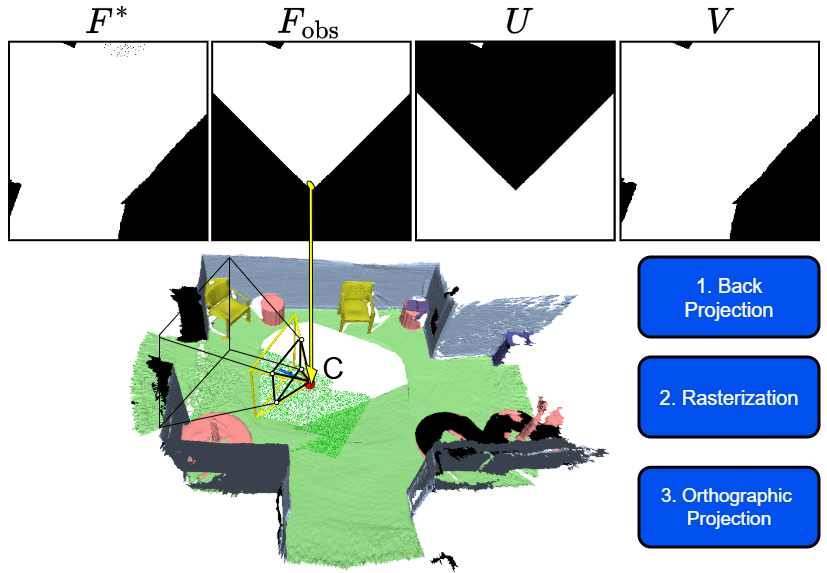
</p>

## Release Status

- Dataset archive and Hub preview are live on [Hugging Face](https://huggingface.co/datasets/Rudra1ssb/FlatLands).
- Model weights, construction code, and additional benchmark tooling are planned for release in this repository.
- This repository does not redistribute upstream RGB-D captures, meshes, point clouds, panoramas, or source archives.

## At A Glance

| Item | Value |
| --- | ---: |
| Observations | 270,575 |
| Real metric indoor scenes | 17,656 |
| Source datasets | 6 |

Source datasets: 3RScan, ARKitScenes, Matterport3D, ScanNet, ZInD, and
ScanNet++.

## Observation Packet

Each observation contains four aligned binary maps plus metadata. The evaluation
region is the valid unobserved area, so observed evidence is preserved and only
the hidden floor map is completed.

<table>
  <tr>
    <td align="center" width="20%">
      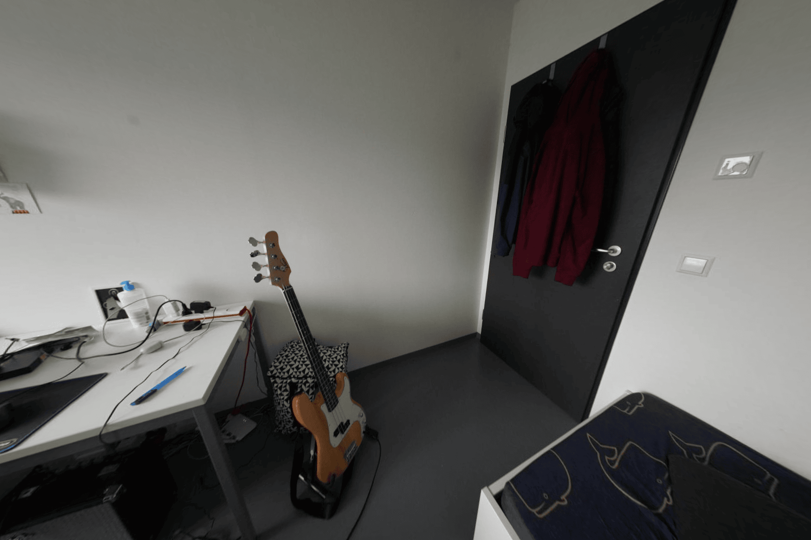
      <br><sub>RGB context</sub>
    </td>
    <td align="center" width="20%">
      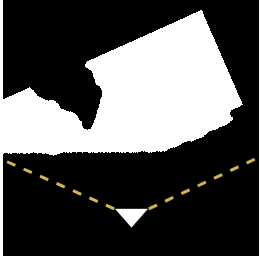
      <br><sub>Observed floor</sub>
    </td>
    <td align="center" width="20%">
      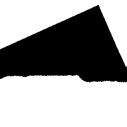
      <br><sub>Unobserved mask</sub>
    </td>
    <td align="center" width="20%">
      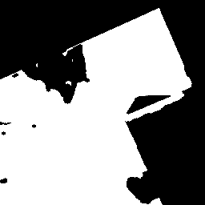
      <br><sub>Complete floor map</sub>
    </td>
    <td align="center" width="20%">
      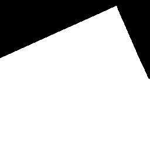
      <br><sub>Validity mask</sub>
    </td>
  </tr>
</table>

```text
obs_*/
  observed_floor.png
  floor_map.png
  unobserved.png
  epistemic_mask.png
  metadata.json
```

## Ambiguous Completion

FlatLands treats floormap completion as a posterior prediction problem. A single
partial observation may be consistent with several valid room layouts; benchmark
metrics therefore include both fidelity and multi-sample uncertainty.

<table>
  <tr>
    <td align="center" width="16%">
      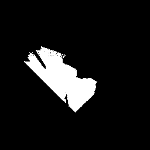
      <br><sub>Observation</sub>
    </td>
    <td align="center" width="16%">
      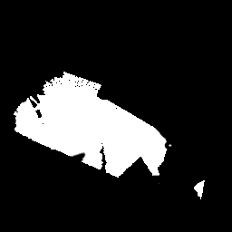
      <br><sub>Completion 1</sub>
    </td>
    <td align="center" width="16%">
      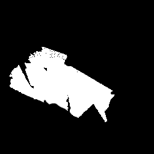
      <br><sub>Completion 2</sub>
    </td>
    <td align="center" width="16%">
      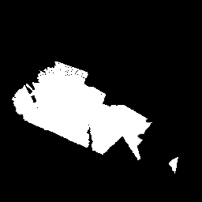
      <br><sub>Completion 3</sub>
    </td>
    <td align="center" width="16%">
      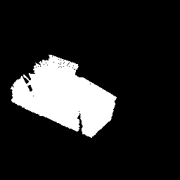
      <br><sub>Completion 4</sub>
    </td>
    <td align="center" width="16%">
      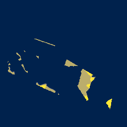
      <br><sub>Variance</sub>
    </td>
  </tr>
</table>

## RGB-To-BEV Pipeline

The paper also evaluates a monocular path from RGB to BEV conditioning: estimate
depth and floor segmentation, project the observed floor into BEV, then sample
floor-map completions.

<table>
  <tr>
    <td align="center" width="16%">
      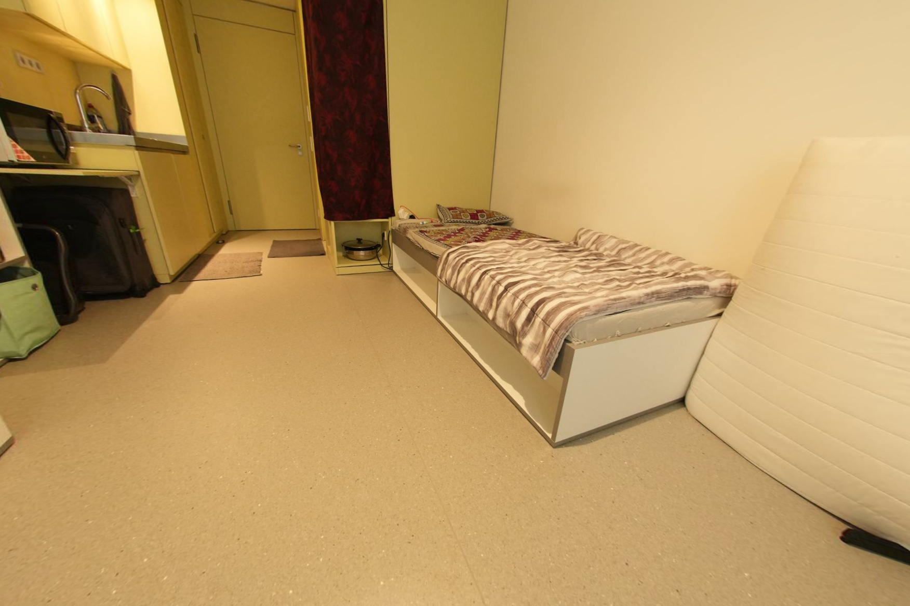
      <br><sub>RGB</sub>
    </td>
    <td align="center" width="16%">
      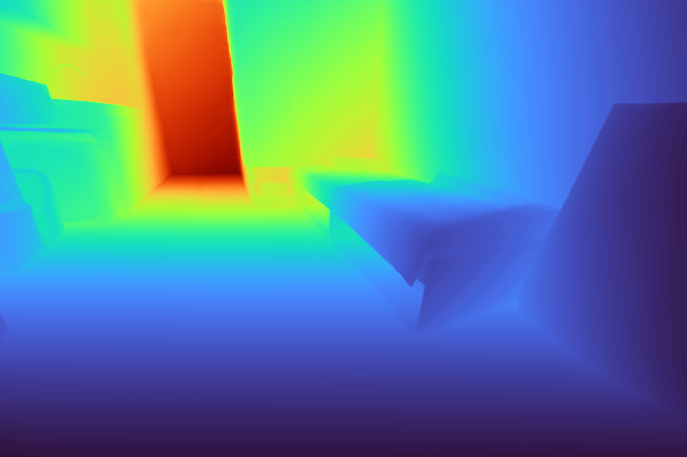
      <br><sub>Depth</sub>
    </td>
    <td align="center" width="16%">
      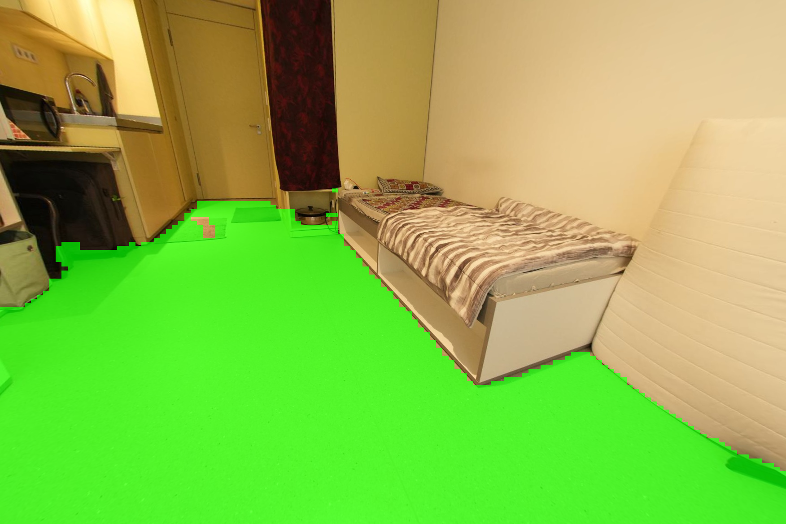
      <br><sub>Floor segmentation</sub>
    </td>
    <td align="center" width="16%">
      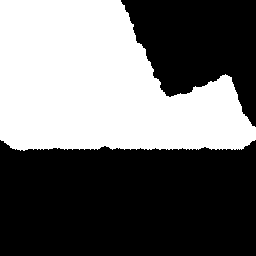
      <br><sub>Observed floor</sub>
    </td>
    <td align="center" width="16%">
      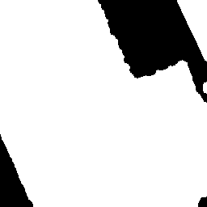
      <br><sub>Sample 1</sub>
    </td>
    <td align="center" width="16%">
      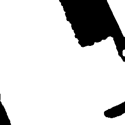
      <br><sub>Sample 2</sub>
    </td>
  </tr>
</table>

## Download

```bash
hf download Rudra1ssb/FlatLands FlatLands_final_dataset.zip --repo-type dataset
unzip FlatLands_final_dataset.zip -d FlatLands
```

Archive integrity:

| File | Size | SHA-256 |
| --- | ---: | --- |
| `FlatLands_final_dataset.zip` | 2,054,773,316 bytes | `e4f2e5c7c54f7ba62ea696fb103fb5d3794f30f5a2e63715773e59d6a9f1d26f` |

The Hub dataset viewer contains small preview parquet splits; the full
270,575-observation release is in the archive above.

## Repository Contents

| Path | Purpose |
| --- | --- |
| [`README.md`](README.md) | Public project index |
| [`PROVENANCE.md`](PROVENANCE.md) | Dataset construction, split, source, and metadata details |
| [`LICENSE`](LICENSE) | FlatLands dataset release notice |
| [`LICENSES.md`](LICENSES.md) | Upstream dataset terms and project links |
| [`COPYRIGHT.md`](COPYRIGHT.md) | Copyright and media/data rights notice |
| [`docs/assets/readme/`](docs/assets/readme/) | README figures and visual examples |

## Data Use

FlatLands is a derived research dataset. Users must comply with the upstream
source dataset terms listed in [`LICENSES.md`](LICENSES.md). If an upstream term
is more restrictive than this release notice, the upstream term controls for the
observations derived from that source.

## Copyright

Copyright (c) 2026 Subhransu S. Bhattacharjee, Dylan Campbell, and Rahul Shome.
FlatLands release materials, derived BEV maps, masks, metadata, statistics, and
provenance records are provided under the FlatLands release notice in
[`LICENSE`](LICENSE). The website and README media are research figures for
explaining the benchmark; underlying source dataset assets remain governed by
their original terms. See [`COPYRIGHT.md`](COPYRIGHT.md) and
[`LICENSES.md`](LICENSES.md).

## Citation

```bibtex
@inproceedings{bhattacharjee2026flatlands,
  title     = {{FlatLands}: Generative Floormap Completion From a Single Egocentric View},
  author    = {Bhattacharjee, Subhransu S. and Campbell, Dylan and Shome, Rahul},
  booktitle = {European Conference on Computer Vision (ECCV)},
  year      = {2026}
}
```

Please also cite the relevant upstream datasets for any FlatLands observations
used in your work.
